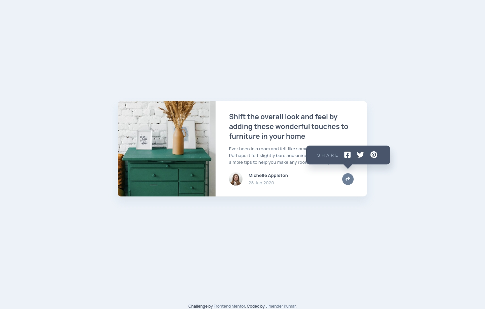

# Frontend Mentor - Article preview component solution

This is a solution to the [Article preview component challenge on Frontend Mentor](https://www.frontendmentor.io/challenges/article-preview-component-dYBN_pYFT). Frontend Mentor challenges help you improve your coding skills by building realistic projects.

## Table of contents

- [Overview](#overview)
  - [The challenge](#the-challenge)
  - [Screenshot](#screenshot)
  - [Links](#links)
- [My process](#my-process)
  - [Built with](#built-with)
  - [What I learned](#what-i-learned)
  - [Continued development](#continued-development)
  - [Useful resources](#useful-resources)
- [Author](#author)
- [Acknowledgments](#acknowledgments)

## Overview

### The challenge

Users should be able to:

- View the optimal layout for the component depending on their device's screen size
- See the social media share links when they click the share icon

### Screenshot

### Links

- Solution URL: [Code](https://github.com/Jimender/article-preview/)
- Live Site URL: [Live](https://jimender.github.io/article-preview/)

## My process

### Built with

- Semantic HTML5 markup
- SASS
- Flexbox
- CSS Grid
- Vanilla JS

### What I learned

Learned about css function minmax.

### Continued development

Explore more about css grids and use it in various projects.

### Useful resources

- [Learn css grid](https://learncssgrid.com/) - CSS Grid is a powerful tool that allows for two-dimensional layouts to be created on the web. This guide was created as a resource to help you better understand and learn Grid, and was organized in a way I thought made the most sense when learning it.

## Author

- Frontend Mentor - [@Jimender](https://www.frontendmentor.io/profile/Jimender)

## Acknowledgments
